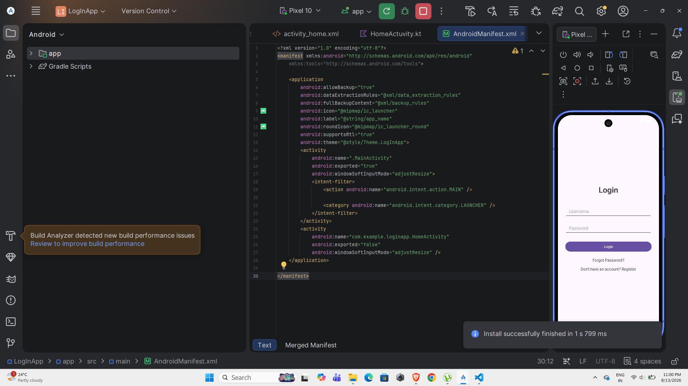
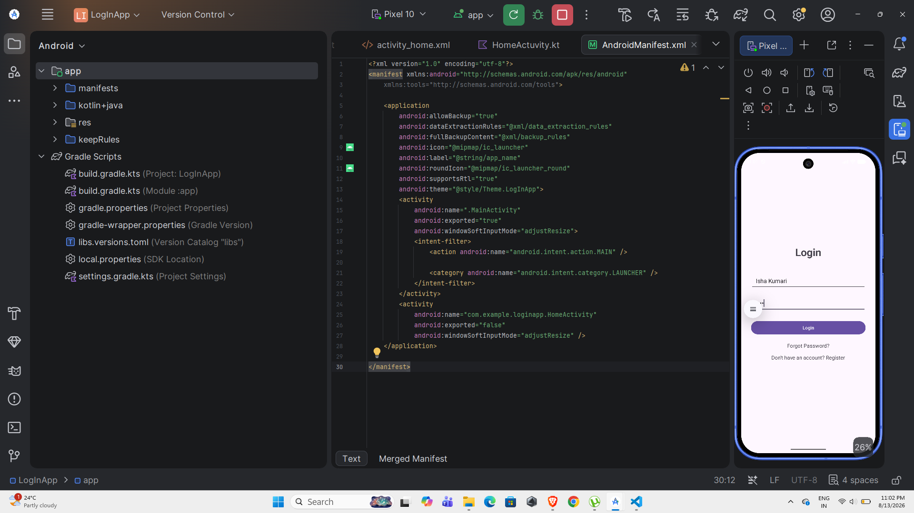
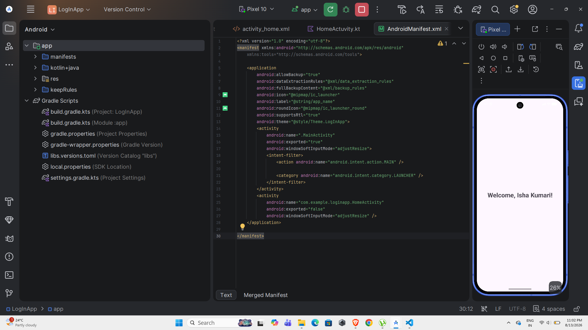

# Experiment 4 – Android Login and Home Page Navigation

**Name:** Isha Kumari  
**USN:** 25MCAR0098  
**Experiment:** 4  
**Topic:** Design and Implement a Login Page with Navigation to Home Page  
**Technology:** Android Studio, Kotlin, XML, Android SDK

---

## 1. Aim

To design and implement a simple Android login application using Kotlin and XML that contains a username field, password field, login button, Forgot Password option, and registration option. On successful login input, the application navigates to a Home page and displays a personalized welcome message using the entered username.

---

## 2. Objective

The objectives of this experiment are:

- To design a proper Login User Interface in Android.
- To use `EditText` for accepting username and password.
- To use a `Button` for handling the login action.
- To navigate from one Activity to another using `Intent`.
- To pass the entered username from the Login Activity to the Home Activity.
- To display a personalized welcome message on the Home page.
- To understand the relationship between XML UI and Kotlin logic.
- To understand basic Activity navigation in Android.

---

## 3. Concept / Technology

This experiment demonstrates basic Android application development using **Kotlin, XML, Android Studio, Activities, and Intent**.

### Android Studio

Android Studio is the official Integrated Development Environment (IDE) used for Android application development. It provides tools for writing code, designing interfaces, running applications, debugging, and testing applications using an emulator or physical device.

### Kotlin

Kotlin is the programming language used to implement the application logic. In this experiment, Kotlin handles the login button click and navigation between Activities.

### XML

XML is used to design the user interface of the application. The Login page contains TextViews, EditTexts, and a Button.

### Activity

An Activity represents a screen of an Android application.

This experiment uses two Activities:

```text
MainActivity
     ↓
Login Page

HomeActivity
     ↓
Home Page
```

### Intent

An Intent is used to move from one Activity to another.

In this experiment, an Intent is also used to pass the username from the Login Activity to the Home Activity.

Example:

```kotlin
val intent = Intent(this, HomeActivity::class.java)
intent.putExtra("username", enteredUsername)
startActivity(intent)
```

---

## 4. Scenario Used

A simple login application is developed for demonstrating Android UI design and Activity navigation.

The Login page contains:

- Username field
- Password field
- Login button
- Forgot Password option
- Registration option

The Forgot Password and Registration options are provided as UI options only. No backend, database, or actual authentication system is implemented because the purpose of this experiment is to demonstrate the Android interface and Activity navigation.

### Application Flow

```text
              LOGIN PAGE
                  │
        ┌─────────┼──────────┐
        │         │          │
     Username  Password   Options
        │         │       Forgot Password
        │         │       Register
        └────┬────┘
             │
        Login Button
             ↓
        HomeActivity
             ↓
     Welcome, Username!
```

For example, if the user enters:

```text
Username: Isha
Password: 1234
```

and clicks Login, the Home page displays:

```text
Welcome, Isha!
```

---

## 5. User Interface

### Login Page

The Login page contains:

```text
          Login

     Username
   ┌───────────────┐
   │               │
   └───────────────┘

     Password
   ┌───────────────┐
   │               │
   └───────────────┘

       [ Login ]

     Forgot Password?

 Don't have an account?
        Register
```

### Home Page

After clicking Login, the application navigates to:

```text
       Welcome!

    Welcome, Isha!
```

---

## 6. Implementation

### Login UI

The Login interface is implemented using XML.

Important components include:

```xml
<EditText
    android:id="@+id/usernameEditText"
    ...
    android:hint="Username" />

<EditText
    android:id="@+id/passwordEditText"
    ...
    android:hint="Password" />

<Button
    android:id="@+id/loginButton"
    ...
    android:text="Login" />
```

The username and password fields allow the user to enter login information.

---

### Login Button Functionality

The Login button is handled in `MainActivity.kt`.

```kotlin
loginButton.setOnClickListener {

    val enteredUsername = username.text.toString()

    val intent = Intent(this, HomeActivity::class.java)

    intent.putExtra("username", enteredUsername)

    startActivity(intent)
}
```

When the Login button is clicked, the entered username is stored in a variable and passed to `HomeActivity`.

---

### Receiving Username in HomeActivity

The Home Activity receives the username using:

```kotlin
val username = intent.getStringExtra("username")
```

The username is then displayed:

```kotlin
welcomeText.text = "Welcome, $username!"
```

Therefore, if the entered username is `Isha`, the Home page displays:

```text
Welcome, Isha!
```

---

## 7. Project Folder and File Structure

```text
Experiment4/
│
├── app/
│   └── src/
│       └── main/
│           ├── java/
│           │   └── com/
│           │       └── example/
│           │           └── loginapp/
│           │               ├── MainActivity.kt
│           │               └── HomeActivity.kt
│           │
│           ├── res/
│           │   └── layout/
│           │       ├── activity_main.xml
│           │       └── activity_home.xml
│           │
│           └── AndroidManifest.xml
│
├── Screenshots/
│   ├── output.png
│   ├── test-case-1-login.png
│   ├── test-case-2-validation.png
│   └── test-case-3-usn.png
│
├── build.gradle / build.gradle.kts
├── settings.gradle / settings.gradle.kts
└── README.md
```

### Important Files

- **`MainActivity.kt`** – Contains the login page logic and navigation to HomeActivity.
- **`HomeActivity.kt`** – Receives the username and displays the welcome message.
- **`activity_main.xml`** – Contains the Login page UI.
- **`activity_home.xml`** – Contains the Home page UI.
- **`AndroidManifest.xml`** – Contains Activity configuration.
- **`README.md`** – Contains documentation of the experiment.
- **`Screenshots/`** – Contains output and test case screenshots.

---

# 8. Test Cases

## Test Case 1 – Login Page Display

**Objective:** Verify that the Login page displays all required UI components.

### Steps

1. Run the application.
2. Observe the Login page.
3. Check for the Username field.
4. Check for the Password field.
5. Check the Login button.
6. Check the Forgot Password option.
7. Check the Registration option.

### Expected Result

The Login page should display:

```text
Login

Username
Password

[ Login ]

Forgot Password?

Don't have an account? Register
```

**Screenshot:**



---

## Test Case 2 – Login and Navigation

**Objective:** Verify that clicking the Login button navigates to the Home page and displays the entered username.

### Steps

1. Enter a username.
2. Enter a password.
3. Click the Login button.
4. Observe the Home page.

### Test Data

```text
Username: Isha
Password: 1234
```

### Expected Result

The application should navigate to the Home page and display:

```text
Welcome, Isha!
```

**Screenshot:**



---

## Test Case 3 – Student Details and Personalized Welcome

**Objective:** Verify the personalized welcome message and demonstrate the student's name and USN.

### Steps

1. Enter the student's name/username.
2. Enter a password.
3. Click Login.
4. Observe the Home page.
5. Verify the welcome message.
6. Verify the student's name and USN in the submitted evidence.

### Expected Result

The Home page should display a personalized message such as:

```text
Welcome, Isha!
```

The screenshot for this test case should also visibly show:

```text
Name: Isha Kumari
USN: 25MCAR0098
```

**Screenshot:**


---

# 9. Output

The final application consists of a Login page and a Home page.

### Login Page

The user enters the username and password and clicks the Login button.

### Home Page

The entered username is passed to the Home Activity and displayed in the welcome message.

For example:

```text
Welcome, Isha!
```

### Output Screenshot



---

# 10. Test Summary

| Test Case | Scenario | Expected Result | Result |
|---|---|---|---|
| TC1 | Open Login page | All Login UI components are displayed | Pass |
| TC2 | Enter username/password and click Login | Home page opens with username | Pass |
| TC3 | Personalized welcome and student details | Username, Name and USN are demonstrated | Pass |

---

# 11. Limitations

This experiment is intentionally implemented without a backend.

Therefore:

- No real user authentication is performed.
- Passwords are not stored.
- No database is connected.
- Registration is only provided as a UI option.
- Forgot Password is only provided as a UI option.
- User credentials are not verified against a server.

The purpose is to demonstrate Android UI design, Activity navigation, and passing data between Activities.

---

# 12. Learning Outcome

After completing this experiment, I understood:

- How to create a Login UI using XML.
- How to use `EditText`, `TextView`, and `Button`.
- How Kotlin interacts with XML UI components.
- How to handle a Button click using `setOnClickListener()`.
- How to use Intent for Activity navigation.
- How to pass data between Activities.
- How to display dynamic data on another Activity.
- How to test an Android application using an emulator.

---

# 13. Conclusion

The Android Login and Home Page application was successfully implemented using Kotlin and XML.

The application provides a Login interface containing username, password, Login, Forgot Password, and Registration options. When the user enters the required information and clicks the Login button, the application navigates to the Home Activity using an Intent.

The username is passed from the Login Activity to the Home Activity and displayed as a personalized welcome message.

The experiment successfully demonstrates basic Android UI development, Activity navigation, and data passing between Activities without requiring a backend or database.

---

# 14. Student Details

**Name:** Isha Kumari  
**USN:** 25MCAR0098  
**Experiment:** 4 – Android Login and Home Page Navigation